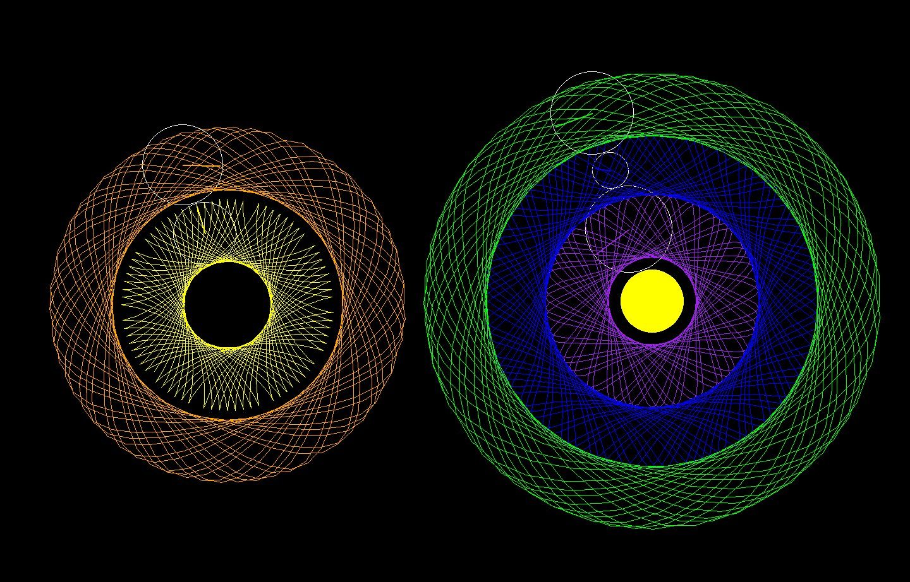

# Pyrograph
python spirograph app.

## Controlls
| Key    | Effekt |
| -------- | ------- |
| S | add new stator     |
| R | add new rotor to selected stator/rotor    |
| Delete | remove selected stator/rotor    |
| LeftMouse Klick | un/select stator/rotor     |
| LeftMouse Drag | move selected stator on surface/move rotor to different parent  |
| Tab  | switch selected rotor to inner/outer mode    |
| C  | change color to random color    |
| PageUP  | increase radius    |
| PageDown  | decrease radius    |
| +  | increase rotation speed 5%    |
| -  | decrease rotation speed 5%   |
| *  | increase trace line length 5%    |
| /  | decrease trace line length 5%    |
| F2 | save pyrograph as Json    |
| F4 | load pyrograph from Json    |
| F12 | save current screen as image    |
| P | freeze/unfreeze screen    |
| H | un/hide rotor/stator but keep trace   |
| D | do (not) draw this stator/rotor and trace  |
| # | print datamodel state to console for inspection  |
| Esc | close window    |

## Features
- [x] Stators draw a color filled circle on the surface.
- [x] Rotors can rotate around/inside stators or other rotors and trace colored lines in a given radius from their center.
- [x] Selected Rotors and stators are highlighted.
- [x] Rotors and stators can be edited in placement and parameters.
- [x] The complete pyrograph hierarchy can be saved and loaded.
- [X] Drawn Images can be saved.

## Crazy Ideas
- what abour 3d balls instead of circles
- what about other 2D shapes than circles
- bind color to a function like distance to center/velocity
- add sound to trace
    - different sounds for collisions with traces/rotors/stators/itself
    - continuous humming with pitch/loudness based on distance to center/velocity/circlesize
- introduce some weird physics
    - rotating a rotor by draging it and keeping momentum for a while before slowing to a halt
    - give rotors a weight and stators gravitational pull and calculate their velocity based on that
    - collisions cause physical reactions like repulsion
- add randomness or other functions to the trace
- derive graph from music